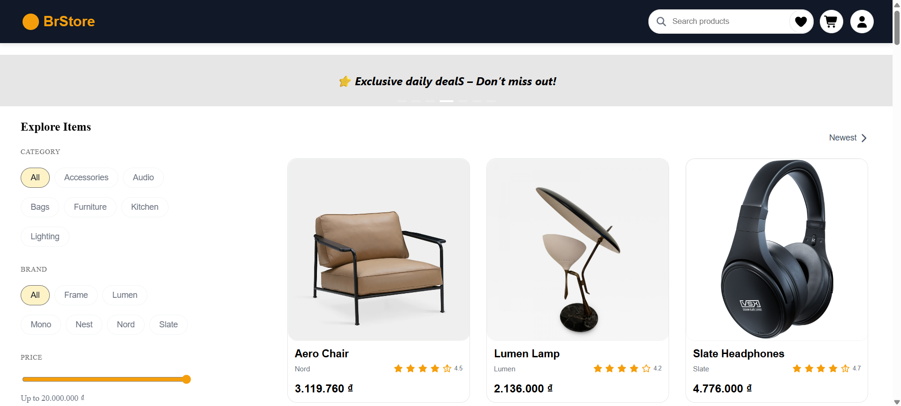

# Minimal Store Project Setup Guide

Follow these step-by-step instructions to install and run this ReactJS project. Even if you're a complete beginner, you'll be able to get it up and running!

## 📸 User Interface Preview

Below is the current UI of the Minimal Store (brstore):



Live Demo: https://brstore.onrender.com/

## 📝 System Requirements

- **Node.js** (version 22.14.0) or latest - [Download Node.js here](https://nodejs.org/)
- **yarn** (comes with Node.js)
- Web browser (Chrome, Firefox, Edge, etc.)

## 🚀 Installation Steps

### 1. Clone the Project from GitHub

Open **Terminal** (Mac/Linux) or **Command Prompt/PowerShell** (Windows) and run:

```bash
git clone https://github.com/ThanhTran2107/minimal-store.git
cd minimal-store  # Move into project directory
```

### 2. Install Dependencies

Run one of these commands to install required packages:

**Using yarn:**

```bash
yarn install
```

### 3. Run the Project

Start the development server:

**With yarn:**

```bash
yarn start
```

The app will automatically open in your browser at:  
👉 [http://localhost:3000](http://localhost:3000)

## 5. 🔧 Useful Commands

| Command             | Description                          | Yarn Equivalent  |
| ------------------- | ------------------------------------ | ---------------- |
| `npm install`       | Install dependencies                 | `yarn install`   |
| `npm start`         | Start development server             | `yarn start`     |
| `npm run build`     | Create production-ready build        | `yarn build`     |
| `npm test`          | Run tests (if available)             | `yarn test`      |
| `npm run lint`      | Check code quality (if using ESLint) | `yarn lint`      |
| `npm run format`    | Format code (if using Prettier)      | `yarn format`    |
| `npm run storybook` | Launch Storybook (if configured)     | `yarn storybook` |
| `npm run eject`     | Eject from CRA (advanced)            | `yarn eject`     |

Key differences to note:

- Yarn commands are typically shorter (no `run` for standard scripts)
- Both package managers support the same scripts defined in `package.json`
- The actual available commands depend on your project setup

## ❓ Need Help?

If you encounter issues:

1. Verify Node.js version (`node -v`)
2. Ensure dependencies are installed (`npm install` or `yarn install`)
3. Open a GitHub Issue or email: **[thanhcnttmcpe@gmail.com]**

---
